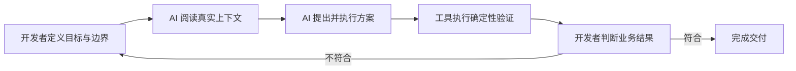
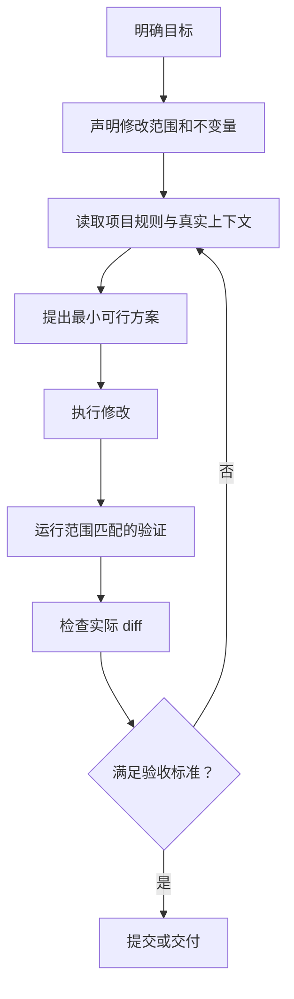

# AI 辅助开发的工程方法

> AI 能够提高编码速度，但真正决定交付质量的，仍然是开发者对目标、边界和验证标准的控制。这篇笔记讨论的不是如何让 AI “多写代码”，而是如何让它在真实工程约束下完成正确的修改。

## 一、先理解 AI 在工程中的位置

AI 擅长阅读代码、归纳信息、生成候选方案和完成重复劳动，但它并不天然理解项目里没有写出来的业务背景。即使模型给出的代码能够运行，也不代表它符合当前迭代目标。

在实际开发中，可以把职责分成两部分：

- 开发者负责确定目标、范围、风险和验收标准。
- AI 负责在这些约束内搜索上下文、提出方案、修改代码和执行验证。

这不是把决策全部交给 AI，而是把可描述、可检查、可重复的工作交给它。



## 二、AI 为什么容易“加”而不是“改”

当项目背景不充分时，新增一个组件、适配层或工具函数通常比理解既有结构更容易。因此，AI 常见的默认行为是：

- 新建一套近似实现，而不是复用已有组件。
- 增加兼容分支，而不是修正数据源。
- 抽象一个未来可能使用的能力，而不是解决当前问题。
- 为了避免修改旧逻辑，在外围继续包一层。

这些做法不一定错误，但会让项目逐渐出现重复实现和过度设计。有效的约束应直接说明：

1. 先搜索已有实现和相似页面。
2. 优先修改真实问题所在的位置。
3. 不为没有出现的需求预留抽象。
4. 新增文件前说明为什么现有结构无法承载。

这正对应 KISS 和 YAGNI：用能解决当前问题的最小方案完成交付。

## 三、把任务说成一个可验证的问题

“帮我优化一下这个页面”通常不是一个足够好的工程任务。更有效的描述至少包含四部分。

### 1. 目标

说明最终要改变什么，而不是只告诉 AI 使用什么技术。例如：

```text
当接口没有业务数据时，不显示统计面板，但保留地图缩放和图层控制。
```

这比“给页面加一个空状态判断”更准确，因为后者可能让 AI 直接隐藏整个页面。

### 2. 修改范围

明确允许修改的项目、目录或文件：

```text
只修改 packages/thinking，不改动其他业务包。
```

修改范围与参考范围不是一回事。AI 可以阅读公共组件和相似模块来理解约定，但只有被授权的范围可以写入。

### 3. 不变量

说明哪些行为不能改变，例如：

- 不修改接口协议。
- 不新增生产依赖。
- 不影响另一个端的实现。
- 保留现有权限判断。
- 不处理工作区中与任务无关的改动。

### 4. 验收标准

验收标准应描述可观察结果：

- 有数据时，原有内容正常显示。
- 无数据时，不发起后续详情请求。
- 地图基础控件仍然可用。
- 指定目录的 ESLint 通过。

目标决定“做什么”，范围决定“在哪里做”，不变量决定“不能破坏什么”，验收标准决定“如何确认完成”。

## 四、如何快速审阅 AI 的方案

面对一份看起来完整的 AI 方案，不需要逐字检查，而应先判断几个关键问题。

### 1. 它解决的是不是原问题

AI 有时会把“数据为空时不显示业务内容”理解成“页面为空时不渲染任何内容”。两句话只差一点，结果却可能完全不同。

先用一句话复述方案的实际效果，再与需求对比。如果无法用一句话说清，说明方案可能已经过度复杂。

### 2. 数据源是否正确

检查它使用的字段、接口和状态是不是业务指定的数据源。常见问题包括：

- 用默认值代替接口真实字段。
- 把合法的 `0` 当成空值。
- 根据页面文案反推业务状态。
- 在没有接口依据时虚构请求地址或字段。

### 3. 是否覆盖完整调用链

一个页面请求可能同时由初始化、区域切换、筛选条件变化和组件重新挂载触发。只在其中一个入口增加判断，往往无法真正解决问题。

审阅时应沿着“触发条件 → 状态变更 → 请求 → 渲染”检查完整链路。

### 4. 是否违反项目约定

重点查看：

- 文件是否放在正确目录。
- 是否复用了项目已有组件。
- 依赖和版本是否符合 monorepo 管理方式。
- 是否硬编码服务地址。
- 是否跨越了 PC、移动端或业务模块边界。
- 是否加入了未要求的测试、文档或重构。

### 5. 是否真的需要新增抽象

如果一个新抽象只服务于当前一个调用点，并且没有降低复杂度，那么它很可能只是把代码搬了位置。

判断标准不是“代码看起来是否高级”，而是它是否让当前行为更容易理解、更容易验证。

## 五、monorepo 中的范围控制

monorepo 会把多个可独立运行的项目放在同一个仓库里。AI 搜索时很容易找到名称相似但业务无关的实现，也可能顺手修改共享包。

建议把范围分成三层：

```text
修改范围：允许写入的目录或文件
参考范围：允许读取的相似实现和公共组件
禁止范围：不能改变的端、包、配置或接口
```

例如：

```text
修改范围：packages/thinking
参考范围：apps/entry 中的模块注册方式
禁止范围：packages/hand-coded-blog、packages/ai-3d
```

如果任务没有明确修改范围，Agent 应先通过项目结构、当前路径和仓库说明进行判断；仍无法安全确定时，再向用户确认，而不是默认修改整个仓库。

## 六、让 AI 使用真实上下文

AI 的幻觉很多时候不是模型凭空出错，而是它没有拿到真实信息。

以网页抓取为例，如果只根据页面截图或名称编写正则和选择器，AI 可能会猜测不存在的 DOM 结构。更可靠的流程是：

1. 使用浏览器工具打开目标页面。
2. 获取真实 DOM、网络请求或可访问性树。
3. 保存具有代表性的结构片段。
4. 根据真实结构设计解析规则。
5. 使用正常、缺失和结构变化样本验证。

同样的原则也适用于接口、数据库和代码库：先读取事实，再生成方案。

## 七、模型能力与工作模式

不同模型、推理强度和执行模式适合不同任务，但不应简单理解成“模型越强，所有任务越好”。

- 小范围、确定性修改更看重速度和指令遵循。
- 跨文件问题定位更需要全局上下文和较强推理。
- 开放式设计需要先收敛问题，再讨论方案。
- 高风险改动需要更严格的审阅和验证，而不是只提高模型等级。

默认自动执行适合边界清楚、可验证的任务。涉及架构选择、数据迁移、危险 Git 操作或外部系统写入时，应把关键决策保留给开发者。

## 八、推荐的工程闭环

一套可复用的 AI 开发流程可以概括为：



其中最容易被忽略的是“检查实际 diff”。验证命令通过，只能说明代码满足某类机器规则；diff 检查才能确认 AI 没有扩大范围、改动无关文件或带入调试代码。

## 九、总结

AI 辅助开发的核心并不是 Prompt 写得多长，而是能否建立清楚的工程边界：

- 用真实上下文减少猜测。
- 用修改范围控制副作用。
- 用项目规则保持一致性。
- 用确定性工具承担可编程验证。
- 用开发者判断确认业务结果。

当目标、边界和验证都明确后，AI 才会从“代码生成器”变成稳定的工程协作者。
