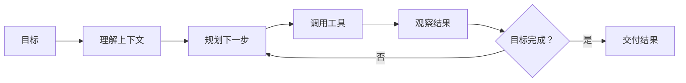
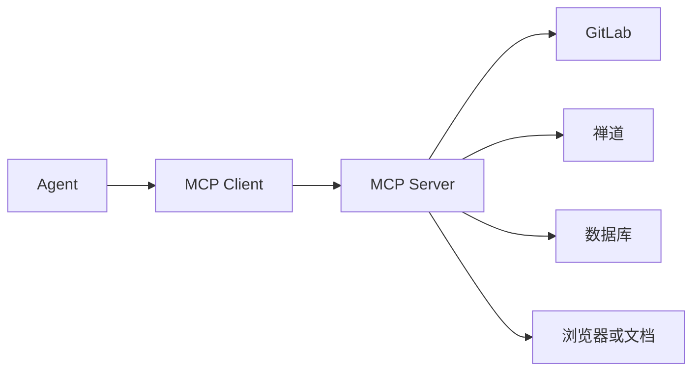
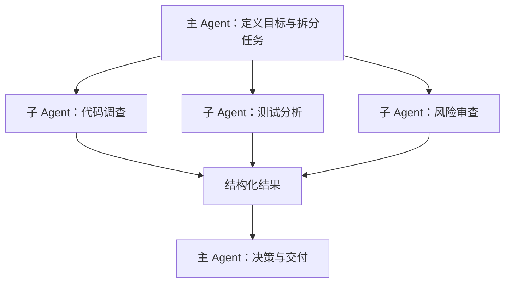

# Agent 应用工程基础

> Agent 应用工程不是简单地给大模型套一层对话界面，而是让模型在明确权限和反馈机制下读取上下文、调用工具并完成任务。这篇笔记介绍 Agent 系统的整体结构，以及开发者需要建立的工程思维。

## 一、从对话模型到 Agent

普通对话通常是一次输入对应一次输出。Agent 则需要围绕目标持续行动：它会观察环境、选择工具、读取结果，并根据新信息调整下一步。



因此，一个能生成代码的模型不一定是一个可靠的编码 Agent。真正的 Agent 还需要：

- 可访问的真实上下文。
- 清晰的工具接口。
- 有限且可审计的权限。
- 可执行的项目规则。
- 失败后的恢复路径。
- 明确的停止条件。

## 二、Agent 系统的核心组成

### 1. Model

模型负责理解目标、推理和生成下一步动作。模型能力决定上限，但系统稳定性不能只依赖模型“足够聪明”。

### 2. Harness

Harness 可以理解为承载 Agent 运行的执行框架。它负责把模型、工具、上下文和执行循环组织在一起，例如：

- 将项目文件提供给模型。
- 把模型生成的工具调用发送给终端或编辑器。
- 将执行结果返回给模型。
- 管理审批、权限、超时和上下文长度。
- 记录任务状态和工具调用。

模型决定“想做什么”，Harness 决定“能如何做”。

### 3. Prompt

Prompt 描述当前任务，包括目标、范围、不变量和期望输出。它适合表达一次性的要求，不适合承载所有长期项目规范。

一个有效的任务 Prompt 通常包括：

```text
背景：为什么要做
目标：最终行为是什么
范围：允许修改哪里
约束：哪些行为不能改变
验证：如何判断完成
```

### 4. Rules 或项目指令

项目指令用于保存长期有效的开发约定，例如目录边界、依赖管理、验证命令和代码风格。

不同 Agent 产品的存储方式不同。以 Codex 为例，仓库约定主要通过分层的 `AGENTS.md` 表达，运行配置则由 `config.toml` 等配置文件负责。不要把项目开发规则、工具配置和一次性任务要求全部塞进同一个文件。

### 5. Tools

工具让 Agent 能够影响外部世界，例如：

- 搜索和读取代码。
- 编辑文件。
- 执行命令。
- 控制浏览器。
- 查询数据库。
- 读取 GitLab、禅道或监控平台。

工具接口越清楚，Agent 越容易稳定使用。与其提供一个“万能执行”工具，不如根据业务提供职责单一、输入输出明确的工具。

### 6. Memory

Memory 用于保存跨任务仍然有价值的信息，例如项目约定、历史决策和用户偏好。但记忆可能过期，因此不应替代实时读取代码、接口文档或外部系统状态。

## 三、Skill 与 Hook 在系统中的位置

Skill 和 Hook 都能提高 Agent 的稳定性，但职责不同。

- **Skill**：把一个可复用任务组织成说明、参考资料和可选脚本，让 Agent 知道在什么场景下按什么步骤工作。
- **Hook**：在工具调用、文件编辑或会话生命周期等事件前后执行外部逻辑，用于拦截、检查或补充上下文。

可以简单理解为：Skill 主要告诉 Agent “这类任务应该怎么做”，Hook 主要在系统边界检查“这个动作是否允许、是否满足机械规则”。

本篇只说明它们在 Agent 架构中的位置，具体的目录结构、规则分类、脚本闭环和 Hook 设计将在后续详解

## 四、MCP 如何连接外部系统

Model Context Protocol（MCP）用于把外部工具和上下文以统一协议提供给模型。Agent 不需要知道 GitLab、禅道或内部数据库的所有实现细节，只需要按照工具定义传入参数并读取结构化结果。



MCP 的价值不是“让 Agent 能调用更多东西”，而是把权限、协议转换、错误处理和业务约束放到受控的服务边界中。

具体设计方法和 GitLab、禅道案例将在 [MCP服务设计与业务实践.md](./MCP服务设计与业务实践.md) 中说明。

## 五、上下文工程

### 1. 上下文不是越多越好

把整个仓库、所有日志和全部历史对话都交给模型，会让真正重要的信息被噪声淹没。上下文工程的目标是提供“完成当前决策所需要的最小充分信息”。

应优先保留：

- 当前需求和最新修正。
- 修改范围内的代码。
- 直接相关的类型和调用链。
- 当前项目规则。
- 能证明问题的错误或运行结果。

应压缩或移除：

- 已经失效的旧方案。
- 与当前模块无关的长日志。
- 可以通过文件路径重新读取的重复内容。
- 没有证据支持的推测。

### 2. 真实数据优先于模型记忆

当任务依赖网页、接口、数据库或代码库时，Agent 应先使用工具获取当前事实。

例如编写页面爬虫时，推荐流程是：

1. 打开真实页面。
2. 读取 DOM 或网络响应。
3. 找到稳定的语义特征。
4. 编写解析逻辑。
5. 使用多个真实样本验证。

如果跳过前两步，选择器和正则很容易建立在想象出来的页面结构上。

## 六、工具设计决定 Agent 的可靠性

一个工具至少应该说清楚：

- 它能做什么，不能做什么。
- 哪些参数必填。
- 参数的格式、范围和含义。
- 是否会修改外部状态。
- 成功结果的结构。
- 失败时返回什么错误。

例如，与其设计：

```text
operateGitLab(action, data)
```

不如拆成：

```text
getMergeRequest(projectId, mergeRequestId)
listReviewDiscussions(projectId, mergeRequestId)
resolveDiscussion(projectId, discussionId)
```

职责单一的工具更容易授权、审计和重试，也能降低 Agent 传错参数的概率。

## 七、权限与风险分级

Agent 的权限不应该只有“允许”和“禁止”两档。可以按照影响范围分级：

### 低风险读取

- 搜索代码。
- 读取文件。
- 查看 Git 状态。
- 查询 MR 和 Bug。

这类操作通常可以自动执行。

### 可恢复写入

- 修改工作区文件。
- 创建临时分支。
- 运行格式化。

这类操作应限制目标范围，并保留 diff 或版本控制作为恢复手段。

### 外部状态变更

- 推送远程分支。
- 解决审查评论。
- 修改数据库。
- 发布版本。

需要确认工具目标、权限和幂等性，必要时增加审批。

### 高风险或不可逆操作

- 强制覆盖远程历史。
- 删除生产数据。
- 批量关闭工单。
- 修改生产环境配置。

这类操作不能只依赖自然语言提醒，应由工具权限、Hook、服务端校验或人工审批共同控制。

## 八、多 Agent 协作

多个 Agent 可以并行处理相互独立的工作，例如：

- 一个 Agent 调查代码调用链。
- 一个 Agent 检查测试缺口。
- 一个 Agent 分析日志或审查安全风险。
- 主 Agent 汇总证据并作出最终修改。



适合并行的任务通常具有三个特点：

- 子任务边界清楚。
- 子任务之间不依赖彼此的中间结果。
- 能用简洁结果返回，而不是共享大量过程状态。

多个 Agent 同时修改同一批文件会增加冲突和协调成本。因此，多 Agent 更适合并行阅读、调查和审查；写入任务应按文件或模块划分明确所有权。

## 九、失败恢复与停止条件

Agent 不能只设计成功路径，还要明确失败之后怎么办。

常见恢复策略包括：

- 参数错误：根据工具的结构化错误修正后重试。
- 网络波动：有限次数重试，并保留退避间隔。
- 权限不足：停止写入，报告所需权限。
- 验证失败：读取错误，修改后重新验证。
- 需求冲突：保留现场，向开发者说明冲突点。
- 外部状态不确定：重新读取当前状态，不盲目重复写入。

同时必须设置停止条件，例如：

- 目标已经满足且验证通过。
- 连续多次出现相同阻塞。
- 继续执行需要新的权限或业务决策。
- 后续操作超出用户授权范围。

没有停止条件的 Agent，容易陷入无意义重试或不断扩大修改范围。

## 十、Agent 应用工程师的能力结构

Agent 应用工程师需要同时理解软件工程和模型行为：

- 能把模糊需求改写成可验证任务。
- 能设计稳定、最小权限的工具接口。
- 能管理上下文而不是无节制堆积信息。
- 能用 Skill 沉淀流程，用 Hook 和脚本落实硬约束。
- 能开发 MCP 服务连接真实业务系统。
- 能识别模型幻觉、过度设计和范围漂移。
- 能设计失败恢复、审计和人工审批机制。

## 十一、总结

一个可靠的 Agent 系统可以概括为：

```text
模型负责推理
Harness 负责执行循环
Prompt 负责当前目标
项目指令负责长期约定
Skill 负责复用流程
Hook 负责生命周期约束
MCP 负责连接外部能力
工具和验证负责提供事实反馈
```

Agent 工程的重点不是追求完全自动化，而是设计一条“模型能发挥能力、系统能限制风险、开发者能验证结果”的工作链路。

## 参考资料

- [OpenAI：构建 Agent Skills](https://learn.chatgpt.com/docs/build-skills)
- [OpenAI：Codex Hooks](https://developers.openai.com/codex/config-advanced#hooks)
- [OpenAI：Model Context Protocol](https://learn.chatgpt.com/docs/extend/mcp)
- [OpenAI：Codex 多 Agent 工作流](https://learn.chatgpt.com/docs/agent-configuration/subagents)
