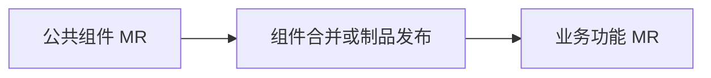

# Git 复杂协作场景与命令

> Git 的难点不是记住命令，而是判断当前基线、需要迁入的提交，以及是否允许改写历史。本文只保留项目协作中常用的几个命令和分批 MR 场景。

## 一、常用命令分别解决什么问题

| 命令 | 主要用途 |
| --- | --- |
| `git cherry-pick` | 将指定提交迁入当前分支 |
| `git reset --soft` | 撤销本地提交，但保留已经暂存的文件改动 |
| `git rebase` | 将当前分支的提交重新应用到新的目标分支之上 |
| `git push --force-with-lease` | rebase 后谨慎更新自己的远程分支 |
| Git Submodule | 让主仓库记录另一个仓库的特定提交 |

执行复杂操作前，先确认现场：

```bash
git status
git fetch origin
git log --oneline --decorate --graph --all -20
```

## 二、`cherry-pick`：只迁入需要的提交

当一个分支包含多个功能，而本次 MR 只需要其中一部分时，可以把指定提交复制到当前分支：

```bash
git switch target-branch
git cherry-pick <commit1> <commit2>
```

发生冲突后：

```bash
git status
# 解决冲突并确认代码含义后
git add <已解决的文件>
git cherry-pick --continue
```

如果发现选错提交，可以退出：

```bash
git cherry-pick --abort
```

`cherry-pick` 会生成新的提交哈希。挑选前还要确认提交之间是否存在依赖，不能只迁入结果代码而漏掉它依赖的类型、组件或配置。

## 三、撤销刚才的提交

如果刚完成的本地提交需要重新拆分或修改提交信息，可以执行：

```bash
git reset --soft HEAD~1
```

执行后：

- 当前分支回到上一个提交。
- 文件改动不会丢失。
- 改动仍然保留在暂存区。

如果要重新选择提交内容：

```bash
git restore --staged <file>
git add <本次需要的文件>
git commit -m "新的提交信息"
```

该命令适合整理尚未共享的本地提交。如果提交已经推送并被其他人使用，应先确认影响，避免随意重写共享历史。

## 四、rebase 与安全更新远程分支

本地功能分支落后目标分支时，可以把自己的提交移动到最新基线：

```bash
git fetch origin
git switch feature-branch
git rebase origin/target-branch
```

发生冲突时，解决冲突后继续：

```bash
git add <已解决的文件>
git rebase --continue
```

如果需要放弃本次 rebase：

```bash
git rebase --abort
```

rebase 会生成新的提交哈希，因此普通推送可能被拒绝。确认远程分支只由自己维护后，可以使用：

```bash
git push --force-with-lease origin feature-branch
```

`--force-with-lease` 会检查远程分支是否仍处于本地预期的状态，比 `--force` 更安全，但它依然会改写远程历史，不应对多人共享分支或受保护分支随意使用。

## 五、从特定提交创建临时分支

从某个提交创建分支的正确写法是：

```bash
git switch -c temp-branch <commit-hash>
```

也可以使用旧版命令：

```bash
git checkout -b temp-branch <commit-hash>
```

创建后先检查它与目标分支的差异：

```bash
git diff origin/target-branch...HEAD
```

推荐把临时分支推送为同名远程分支，再创建 MR：

```bash
git push -u origin temp-branch
```

```text
temp-branch → target-branch
```

下面这条命令含义不同：

```bash
git push origin temp-branch:target-branch
```

它会用本地 `temp-branch` 直接更新远程 `target-branch`，可能绕过预期的 MR 流程，因此不作为默认方案。

## 六、复杂场景：将大改动拆成多个 MR

假设当前存在以下情况：

- 本地改动已经超过单个 MR 的行数限制。
- 改动由多个提交组成。
- 本地分支落后于 MR 目标分支。
- 部分业务代码依赖尚未合并或发布的公共组件。

处理思路是：先按依赖关系整理提交，再从最新目标分支创建干净分支，精确迁入每个 MR 需要的内容。

### 1. 查看待拆分提交

```bash
git fetch origin
git log --oneline origin/target-branch..original-feature
```

不要机械地按行数平均拆分，应按依赖关系组织，例如：

```text
MR 1：公共类型和基础组件
MR 2：依赖基础组件的页面功能
MR 3：可以独立合入的后续优化
```

### 2. 创建第一个 MR 分支

```bash
git switch -c feature-part-1 origin/target-branch
git cherry-pick <commit-a> <commit-b>
git push -u origin feature-part-1
```

然后创建：

```text
feature-part-1 → target-branch
```

### 3. 创建后续 MR 分支

如果第二部分依赖第一部分，可以暂时从第一部分创建：

```bash
git switch -c feature-part-2 feature-part-1
git cherry-pick <commit-c> <commit-d>
git push -u origin feature-part-2
```

第一部分合并后，再让第二部分基于最新目标分支。对复杂 `rebase --onto` 不熟悉时，重新从目标分支创建干净分支并 cherry-pick 所需提交，更容易检查和恢复。

### 4. 处理公共组件依赖

如果业务代码必须等待公共组件合并或制品发布，应把公共组件作为前置 MR，并在业务 MR 中明确依赖关系：



不要为了让当前 CI 临时通过，就把公共组件实现复制进业务模块。前置依赖完成后，再 rebase 业务分支并处理冲突。

## 七、Git Submodule

Submodule 让主仓库记录另一个仓库的特定提交，适合需要独立版本和权限的公共项目。

克隆时同时获取子模块：

```bash
git clone --recurse-submodules <repository-url>
```

仓库已经克隆时初始化：

```bash
git submodule update --init --recursive
```

子模块更新后，主仓库还需要提交新的子模块指针：

```bash
git add <submodule-path>
git commit -m "chore: 更新子模块版本"
```

如果只在子模块目录修改代码，却没有在子模块仓库提交和推送，其他开发者无法获得这些改动。

## 八、执行前检查

在 rebase、reset、强制推送或跨名称推送前，确认：

- 当前分支和目标分支正确。
- 工作区没有未保存的重要改动。
- 已执行 `git fetch` 获取远程最新状态。
- 已检查提交图和实际 diff。
- 操作对象不是多人共享分支。
- 知道失败后如何使用 `--abort` 退出。

## 九、总结

复杂 Git 协作可以先回答三个问题：

```text
本次修改应该基于哪个提交？
本次 MR 真正需要哪些提交？
当前分支是否允许改写历史？
```

确认这三个问题后，再选择 `cherry-pick`、`rebase` 或 `reset`。默认把改动推送到独立功能分支，通过 MR 更新目标分支，能够让每一步更容易审查和恢复。
