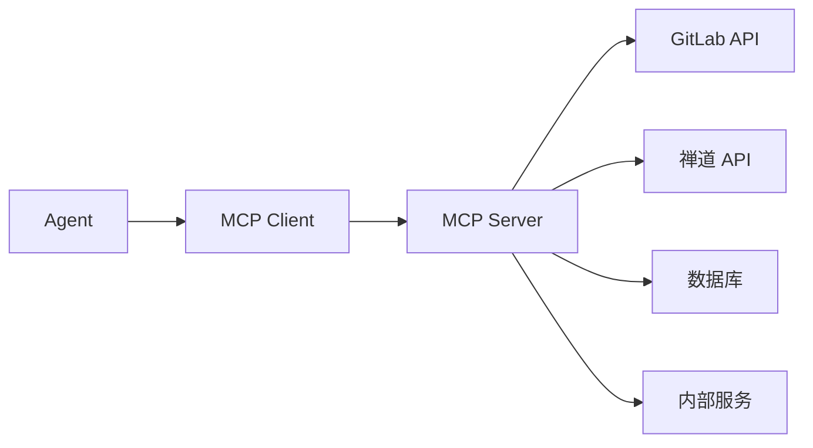
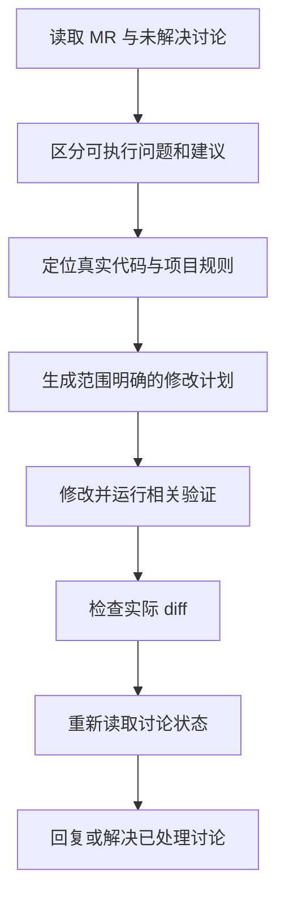

# MCP 服务设计与业务实践

> MCP 的价值不是给模型增加一个“万能接口”，而是用稳定、可授权、可审计的协议，把代码仓库、项目管理系统、数据库和浏览器等真实能力提供给 Agent。

## 一、MCP 解决什么问题

没有工具时，模型只能根据 Prompt 和已有上下文回答问题。真实工程任务却经常依赖外部状态，例如：

- GitLab 中当前 MR 的审查评论。
- 禅道中分配给某个用户的 Bug。
- 数据库中的业务记录。
- 浏览器当前页面的 DOM。
- 内部文档中的最新接口说明。

如果每个 Agent 产品都为这些系统编写一套私有集成，开发和维护成本会很高。Model Context Protocol（MCP）提供了统一的连接方式，让宿主以相似方式发现并调用外部能力。



MCP 不负责替 Agent 做所有决策。它负责提供真实数据和受控动作，Agent 仍然需要根据任务目标决定何时调用、如何组合以及何时停止。

## 二、MCP Client 与 Server 的职责

### 1. MCP Client

Client 通常集成在 Agent 宿主中，负责：

- 连接 MCP Server。
- 发现 Server 暴露的能力。
- 将工具定义提供给模型。
- 发送模型生成的工具调用。
- 把执行结果送回模型。
- 根据策略处理授权和审批。

### 2. MCP Server

Server 负责：

- 连接真实业务系统。
- 校验工具参数。
- 处理认证和权限。
- 转换外部系统的数据格式。
- 返回结构化结果和可操作错误。
- 限制高风险动作。

以禅道为例，账号登录、Cookie、分页和接口差异应封装在 Server 内，Agent 不需要在每次任务中重新理解这些细节。

## 三、MCP 暴露哪些能力

从设计角度看，可以把 MCP 能力理解为三类。

### 1. Tools

Tool 用于执行具有明确输入输出的操作，例如：

```text
listAssignedBugs(userId, moduleId)
getBugDetail(bugId)
listMergeRequestDiscussions(projectId, mergeRequestId)
resolveDiscussion(projectId, discussionId)
```

Tool 可能只读，也可能修改外部状态。写入型 Tool 应比读取型 Tool 具有更严格的权限和审批策略。

### 2. Resources

Resource 适合暴露可读取的上下文，例如接口文档、项目说明或固定数据集。它强调“读取某项内容”，而不是执行一个业务动作。

### 3. Server Instructions

Server 可以提供跨工具都适用的说明，例如调用顺序、速率限制和权限边界。重要约束应简洁、明确，不能只藏在冗长文档中。

不同宿主对 MCP 能力的支持程度可能不同，开发时应以目标宿主的当前文档和实际工具发现结果为准。

## 四、工具设计原则

### 1. 一个工具只承担一个清晰动作

不推荐：

```text
operateSystem(action, payload)
```

推荐：

```text
getBugDetail(bugId)
updateBugStatus(bugId, status)
addBugComment(bugId, content)
```

职责单一能够减少参数组合错误，也方便分别授权只读和写入能力。

### 2. 输入应尽可能结构化

与其让 Agent 传入一整段自然语言，不如定义：

```json
{
  "projectId": 100,
  "mergeRequestId": 42,
  "includeResolved": false
}
```

参数还应明确必填项、取值范围和默认行为。对项目 ID、分支名和 Bug ID 等关键目标，Server 应再次校验。

### 3. 输出应稳定并保留证据

返回结果应区分业务数据和展示文案，例如：

```json
{
  "bugId": 1234,
  "title": "保存后详情未回显",
  "status": "active",
  "steps": ["进入详情页", "修改数据", "点击保存"],
  "attachments": [],
  "sourceUrl": "..."
}
```

Agent 可以根据结构化字段制定计划，同时保留 `sourceUrl` 或唯一 ID 便于开发者回查。

### 4. 错误必须可操作

只返回“调用失败”无法帮助 Agent 恢复。更好的错误应包含：

- 错误类型。
- 失败对象。
- 是否可以重试。
- 缺少的权限或参数。
- 推荐的下一步。

例如：

```text
AUTH_EXPIRED：禅道会话已失效，当前请求未写入任何数据，请重新认证后重试。
```

### 5. 写入操作要考虑幂等性

网络超时并不代表服务端没有成功。如果 Agent 直接重试“新增评论”，可能产生重复数据。

可以通过幂等键、执行前查询或返回操作 ID 解决：

```text
读取当前状态 → 判断是否已经完成 → 只在未完成时写入
```

## 五、认证与安全

### 1. 凭据不进入 Prompt

账号、密码、访问令牌应存储在环境变量、系统凭据存储或 OAuth 会话中，由 MCP Server 读取。不要让 Agent 在对话中保存或回显凭据。

### 2. 使用最小权限

只读取 MR 的 Server 不需要仓库管理权限；只查询 Bug 的工具不应默认具备删除工单能力。

可以按风险拆分：

- 只读工具自动批准。
- 写入工具需要明确授权。
- 删除、发布和批量修改需要人工审批。

### 3. 防止参数越权

即使 Agent 传入了一个路径或项目 ID，Server 也必须验证它是否位于允许范围内。自然语言中的“只操作当前项目”不能替代服务端权限判断。

### 4. 保留审计信息

对外部状态变更，至少记录：

- 谁发起操作。
- 使用了哪个工具。
- 操作目标是什么。
- 参数摘要和结果。
- 执行时间和关联任务。

审计日志应避免记录完整令牌和其他敏感数据。

## 六、GitLab MCP 实践

一个用于处理 MR AI Review 的 MCP，可以暴露以下只读能力：

- 获取 MR 元数据和目标分支。
- 获取 diff 或变更文件列表。
- 获取讨论线程及其解决状态。
- 获取行内评论对应的文件和行号。
- 获取流水线与检查状态。

写入能力可以包括：

- 回复讨论。
- 将讨论标记为已解决。
- 创建或更新 MR 描述。

推荐工作流：



关键点是先读取真实讨论，而不是只根据 MR 标题猜测问题；只有确认修改已经覆盖评论内容后，才应该解决讨论。

## 七、禅道 MCP 实践

禅道 MCP 的目标可以定义为：根据认证用户和模块，返回可供 Agent 规划的 Bug 数据。

### 1. 推荐工具划分

```text
getCurrentUser()
listAssignedBugs(moduleId, status, page)
getBugDetail(bugId)
getBugAttachments(bugId)
```

在没有明确业务授权前，先不提供关闭 Bug、修改指派人等高风险写入工具。

### 2. 统一返回结构

不同禅道版本或页面接口的字段可能不同，Server 应转换为统一结构：

```text
Bug ID
标题
所属模块
当前状态
严重程度
复现步骤
相关附件
创建者与指派人
原始详情地址
```

### 3. 与修复 Skill 组合

MCP 提供“真实 Bug 数据”，Skill 提供“如何修复”的流程。两者边界如下：


模块、目标分支和项目绝对路径是三个重要边界：

- 模块限制 Agent 读取哪些 Bug。
- 分支确定修改基线。
- 项目路径限制文件写入范围。

## 八、网页抓取类 MCP

网页抓取最常见的问题，是根据想象编写选择器或正则。页面标题和截图无法证明真实 DOM 层级，因此应先获取实际页面结构。

推荐流程：

1. 使用具有登录态的浏览器打开页面。
2. 获取 DOM、可访问性树或接口响应。
3. 找到稳定属性，避免依赖易变化的样式类名。
4. 保存脱敏后的代表性样本。
5. 编写解析器。
6. 验证正常、缺失字段、空列表和页面结构变化。

正则适合提取局部、格式稳定的文本，不适合解析任意嵌套 HTML。能使用 DOM 解析器时，应优先使用 DOM 解析器。

## 九、测试 MCP Server

MCP Server 至少需要验证三层行为。

### 1. 工具契约

- 必填参数缺失时是否返回明确错误。
- 枚举和 ID 是否被正确校验。
- 返回结构是否稳定。

### 2. 外部系统适配

- 登录过期如何处理。
- 分页是否完整。
- 限流和超时是否可以恢复。
- 外部字段缺失时是否安全降级。

### 3. Agent 使用效果

- 工具描述能否让 Agent 选对工具。
- Agent 是否能根据错误修正参数。
- 写入前是否会读取当前状态。
- 工具返回是否包含完成任务所需证据。

工具在单元测试中可调用，不代表模型一定能正确选择它。还需要用真实任务 Prompt 验证工具名称、描述和返回结果是否足够清楚。

## 十、常见反模式

### 1. 一个工具承载所有动作

结果是参数难以校验，权限无法拆分，Agent 也难以选择。

### 2. 把账号密码作为工具参数

凭据会进入对话上下文和调用日志，增加泄露风险。

### 3. 只返回网页拼接文本

Agent 很难稳定识别字段，也无法区分缺失数据和空字符串。

### 4. 超时后无条件重试写入

可能产生重复评论、重复工单或重复状态变更。

### 5. 让 MCP Server 替模型做全部业务判断

Server 应负责权限和确定性校验，但不必把所有开放式推理都固化在服务端。否则它会变成一个难以维护的巨型业务系统。

## 十一、总结

MCP 服务设计的核心是建立可靠边界：

```text
Agent 负责理解目标和编排动作
MCP Client 负责连接与转发
MCP Server 负责协议适配、权限和校验
外部系统保存真实业务状态
```

一个好的 MCP 工具应该让 Agent 更接近事实，同时让危险动作更难发生。连接能力只是第一步，结构化契约、最小权限、错误恢复和审计才决定它能否进入真实工程流程。

## 参考资料

- [OpenAI：Model Context Protocol](https://learn.chatgpt.com/docs/extend/mcp)
- [Model Context Protocol 官方文档](https://modelcontextprotocol.io/)
