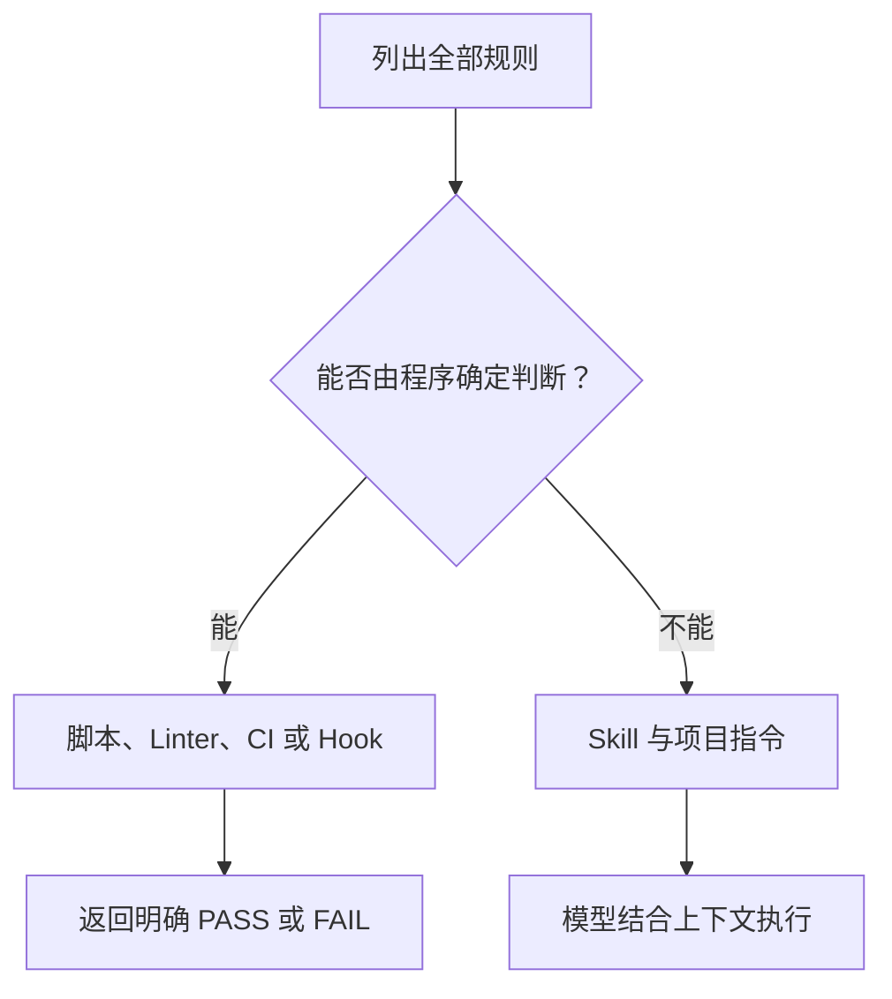
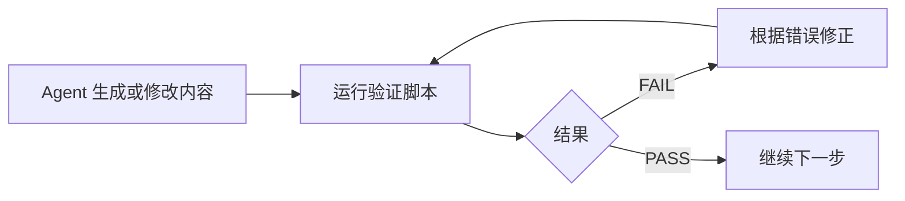

# Skill 与 Hook 的工程化约束

> 只在 Prompt 中反复强调“请严格遵守规则”，并不能建立稳定的工程流程。更可靠的做法是：用 Skill 描述可复用的工作方法，用脚本验证确定性规则，用 Hook 在系统边界执行检查。

## 一、为什么自然语言约束不够

自然语言擅长表达意图，但不擅长保证每一次执行都得到完全一致的结果。

例如：

```text
请只修改指定目录。
请确保提交信息符合规范。
请不要提交超过 2500 行的改动。
```

这些要求模型通常能够理解，却仍可能因为上下文过长、任务变化或工具使用失误而遗漏。只要规则能够被程序判断，就不应该把最终验证权完全交给生成代码的模型。

这可以概括为三个原则：

1. 可编程的约束，优先交给程序执行。
2. 生成者不能成为唯一验证者。
3. “失败 → 修正 → 重跑”的闭环优于一次性提醒。

## 二、Skill 是什么

Skill 是面向特定任务的可复用工作流。它通常是一个目录，包含入口说明和可选资源：

```text
example-skill/
├── SKILL.md
├── scripts/
├── references/
├── templates/
└── assets/
```

其中：

- `SKILL.md`：说明什么时候使用、需要哪些输入、按什么步骤执行。
- `scripts/`：承载确定性检查或重复操作。
- `references/`：保存领域规则、接口说明和背景材料。
- `templates/`：提供固定输出结构。
- `assets/`：提供生成结果需要复用的资源。

一个 Skill 应聚焦一个明确任务。例如“修复 GitHub CI”比“处理所有代码问题”更容易稳定触发和执行。

## 三、Skill 与斜杠命令不是同一个概念

有些 Agent 产品会把 Skill 暴露为斜杠命令、选择器或可提及对象，但 Skill 的本质不是某一种 UI 命令，而是可复用的任务说明与资源集合。

以当前 Codex 文档为例，Skill 可以由 Agent 根据描述自动匹配，也可以由用户显式选择；不同宿主的显式入口可能不同。因此，编写 Skill 时不应把核心逻辑绑定到某个固定按钮或命令格式。

真正影响自动匹配的是名称、描述和任务边界。描述应回答：

- 什么请求应该触发它。
- 什么请求不应该触发它。
- 它会读取或修改什么。
- 它需要哪些工具和前置条件。

## 四、先把规则分成两类

编写 Skill 前，先列出希望 Agent 遵守的所有规则，再分为硬规则和软规则。

### 1. 硬规则：可以写成条件判断

例如：

- 只能修改指定目录。
- 文件不能超过指定大小。
- 提交信息必须匹配格式。
- 不能出现硬编码 Host。
- 移动端样式不能使用 `gap`。
- 修改 TypeScript 文件后必须执行指定检查。

这类规则应尽量写进脚本、Linter、类型检查或 CI。

### 2. 软规则：依赖语义判断

例如：

- 方案应保持简单。
- 文档以讲解为主。
- 命名应符合业务语境。
- 优先复用现有组件。
- 不要为了未来需求提前抽象。

这类规则适合保留在 `SKILL.md` 或项目指令中，由模型结合上下文判断。



## 五、一个可执行 Skill 的基本结构

`SKILL.md` 至少需要说明以下内容：

### 1. 触发条件

```text
当用户要求提交当前改动，或要求生成并执行 Git commit 时使用。
仅要求解释 Git 命令时不使用。
```

### 2. 必需输入

```text
目标仓库、允许提交的路径、目标分支、提交类型。
```

### 3. 执行步骤

使用命令式、可观察的步骤：

1. 读取 Git 状态。
2. 确认允许提交的文件范围。
3. 根据文件类型选择验证命令。
4. 检查实际 diff。
5. 生成提交信息。
6. 只暂存目标文件。
7. 执行提交。

### 4. 失败处理

说明哪些错误可以自动修复，哪些必须停止：

- 格式检查失败：修复后重新运行。
- 出现范围外文件：不暂存，继续处理目标文件。
- 目标分支不明确：停止并确认。
- 需要重写远程历史：不自动执行。

### 5. 完成标准

例如：

```text
目标文件验证通过、暂存范围正确、提交成功，并且工作区中的无关改动仍被保留。
```

## 六、把验证写进脚本

假设规则要求只允许修改 `packages/thinking`，可以编写一个检查脚本读取 Git diff，并在发现范围外文件时返回非零退出码。

脚本的输出应该面向 Agent，而不只是面向人：

```text
FAIL: 检测到范围外改动 packages/ai-3d/src/index.ts
允许范围: packages/thinking/**
处理建议: 不要修改或暂存该文件，重新检查目标 diff
```

好的验证脚本具有以下特点：

- 退出码明确。
- 错误信息指出具体文件或字段。
- 不在失败时静默修改代码。
- 支持重复运行。
- 相同输入产生相同判断。

然后在 Skill 中建立闭环：



## 七、`/commit` 工作流示例

一个提交类 Skill 不应该只是执行 `git commit`，而应承担提交前动作链：

### 1. 确认范围

- 读取 `git status`。
- 区分目标改动和用户已有改动。
- 禁止使用无差别的全量暂存。

### 2. 按文件类型路由验证

- Vue、TypeScript：执行项目指定的 ESLint 或类型检查。
- 样式文件：执行样式规则检查。
- 依赖文件：确认锁文件是否同步。
- 共享组件：提示检查影响范围。

具体命令必须来自当前仓库规则，而不是 Skill 自行猜测。

### 3. 检查 diff

- 是否存在调试代码。
- 是否混入无关格式化。
- 是否新增不必要文件。
- 是否超过团队约定的 MR 规模。

### 4. 生成并执行提交

只有所有必要检查通过后，才根据实际 diff 生成提交信息，并且只暂存目标路径。

## 八、业务 Skill：Bug 自动修复

以 `tandao-fixed` 一类 Bug 修复 Skill 为例，关键不是“让 AI 自动修 Bug”，而是建立清楚的输入边界：

```text
模块 ID：决定从哪里读取 Bug
目标分支：决定基于哪份代码修改
项目路径：决定允许写入的范围
执行模式：只生成计划，还是实施指定 Bug
```

工作流可以设计为：

1. 通过 MCP 获取指定模块的 Bug 列表。
2. 读取 Bug 详情、附件和复现条件。
3. 确认当前分支与项目路径。
4. 搜索相关代码并生成计划。
5. 只在授权范围实施修改。
6. 运行项目允许的验证。
7. 输出需要人工验证的步骤。

如果测试系统未来也通过 MCP 暴露能力，可以继续形成“修改 → 部署测试环境 → 执行用例 → 返回结果”的闭环。但在没有真实测试能力时，Skill 应明确标注需要人工验证，而不是宣称 Bug 已完全解决。

## 九、Hook 是什么

Hook 是在 Agent 生命周期或工具事件前后执行的外部逻辑。它运行在模型推理之外，因此适合承担模型不应该自行绕过的检查。

常见场景包括：

- 执行命令前检查是否为危险命令。
- 编辑文件前确认路径是否在允许范围内。
- 工具执行后记录审计信息。
- 会话结束前检查是否遗漏验证。
- 向 Agent 注入工具无法直接看到的上下文。

Hook 的具体事件名和配置格式取决于宿主产品和版本，应以当前官方文档为准。设计层面的职责则相对稳定：它是在动作边界执行机械约束，而不是替代 Agent 完成业务推理。

## 十、Hook 的输入、输出和失败语义

一个可靠 Hook 应明确三个问题。

### 1. 它接收什么

例如工具名称、命令文本、目标文件、当前工作目录和会话状态。

### 2. 它能返回什么

例如：

- 允许执行。
- 拒绝执行并说明原因。
- 修改工具参数。
- 向 Agent 补充上下文。

### 3. 它失败时意味着什么

安全类 Hook 应倾向于失败即拒绝；记录类 Hook 可以在不影响主要任务的情况下报告异常。不能让一个无关的日志服务故障阻塞所有代码读取，也不能让一个路径校验 Hook 失败后默认放行。

## 十一、Skill、Hook、Rule 和 CI 的边界

| 能力 | 主要职责 | 典型示例 |
| --- | --- | --- |
| 项目 Rule | 长期开发约定 | 目录规范、依赖策略、验证要求 |
| Skill | 可复用任务流程 | 提交代码、修复 CI、处理指定模块 Bug |
| Hook | 动作边界约束 | 拦截危险命令、限制写入路径 |
| CI | 仓库最终门禁 | Lint、构建、测试、合并策略 |

四者不是替代关系：

- Rule 让 Agent 知道团队希望怎样工作。
- Skill 把一次完整工作组织成步骤。
- Hook 阻止特定危险或违规动作。
- CI 在代码进入共享分支前提供最终验证。

## 十二、避免把所有约束都放进 Hook

Hook 更确定，但并不意味着越多越好。以下内容不适合强行写成 Hook：

- 这个抽象是否过度设计。
- 文案语气是否自然。
- 业务流程是否符合用户习惯。
- 两个合理方案中应该选择哪一个。

如果把所有语义判断都程序化，最终会得到大量脆弱的关键字判断。正确做法是让机器执行可确定的门禁，让模型和开发者处理需要上下文的判断。

## 十三、总结

Skill 与 Hook 的组合目标不是让 Agent 失去自主性，而是把自主性放在合适的位置：

```text
Skill 说明路线
脚本提供事实判断
Hook 守住动作边界
CI 守住共享仓库
开发者负责最终业务决策
```

当规则可以被执行、错误可以反馈、失败可以修正时，Agent 工作流才从“依赖模型记得遵守”升级为可重复的工程系统。

## 参考资料

- [OpenAI：构建 Agent Skills](https://learn.chatgpt.com/docs/build-skills)
- [OpenAI：Codex Hooks](https://developers.openai.com/codex/config-advanced#hooks)
- [Agent Skills 开放规范](https://agentskills.io/specification)
