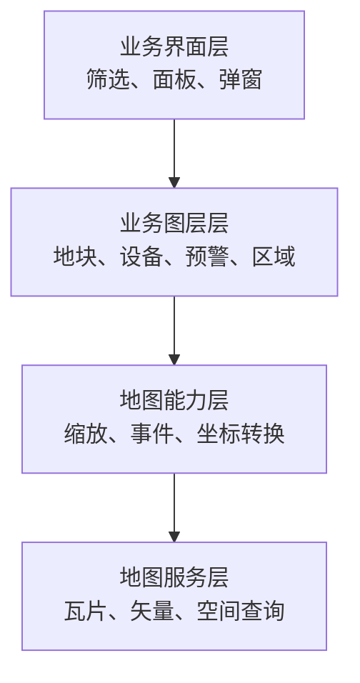

# WebGIS 地图业务基础

> 地图页面不是在普通页面上放一张图片。它同时涉及空间数据、坐标系统、地图服务、图层生命周期和业务交互。理解这些基本概念，才能正确定位“地图不显示”“图斑偏移”或“切换区域后重复加载”等问题。

## 一、地图前端由什么组成

一个典型 WebGIS 页面可以分为四层：



- **业务界面层**：普通前端组件，负责查询条件、统计信息和详情展示。
- **业务图层层**：把地块、设备、行政区等业务数据绘制到地图上。
- **地图能力层**：由地图 SDK 提供视图、投影、交互和图层管理。
- **地图服务层**：提供底图、瓦片、矢量数据或空间分析结果。

排查问题时，应先判断故障发生在哪一层，而不是看到地图空白就立即修改渲染代码。

## 二、底图、图层和图斑

### 1. 底图

底图提供道路、行政区、影像和地名等基础地理背景。常见形式包括：

- 矢量瓦片。
- 栅格瓦片。
- 卫星影像。
- 自建 GIS 服务发布的基础地图。

底图通常位于最下层，不直接携带当前业务的地块或设备状态。

### 2. 图层

图层是一组可以统一显示、隐藏、排序和销毁的地图对象。例如：

- 行政区边界层。
- 农田地块层。
- 传感器点位层。
- 灾害预警层。
- 标签层。

把不同职责的数据拆成图层，可以避免所有对象混在一起，方便控制层级和交互。

### 3. 图斑

图斑通常指地图上的一个面状空间对象，例如一块农田、一个承保地块或一个灾害影响区域。它包含两类信息：

```text
几何信息：边界坐标、面积、中心点
业务属性：地块名称、主体、作物、状态
```

同一个业务对象可能有属性数据但没有有效几何，也可能几何存在但详情接口尚未返回。前端应区分这两种状态。

## 三、点、线、面

地图业务最常见的几何类型是：

- **Point**：设备、人员位置、企业地址。
- **LineString**：道路、河流、巡检轨迹。
- **Polygon**：地块、行政区、风险区域。
- **MultiPolygon**：由多个不连续区域组成的业务范围。

几何类型会影响渲染方式和交互逻辑。例如，点位适合聚合，面适合填充与描边；不能用处理单个 Polygon 的逻辑直接假设所有地块都只有一个闭合环。

## 四、常见空间数据格式

### 1. GeoJSON

GeoJSON 使用 JSON 表达几何和属性，适合 Web 端传输和调试：

```json
{
  "type": "Feature",
  "geometry": {
    "type": "Point",
    "coordinates": [120.1, 30.2]
  },
  "properties": {
    "name": "示例点位"
  }
}
```

需要注意坐标顺序通常是 `[经度, 纬度]`，不要因为日常习惯说“纬经度”就交换数组位置。

### 2. WKT

Well-Known Text 使用文本表示几何：

```text
POINT (120.1 30.2)
POLYGON ((120.0 30.0, 120.2 30.0, 120.2 30.2, 120.0 30.0))
```

接口返回 WKT 时，前端通常需要解析为地图 SDK 能识别的几何对象。解析时要处理空值、`MULTIPOLYGON` 和坐标系信息。

### 3. 瓦片

瓦片把地图按缩放级别和网格切成小块，客户端只加载当前视野需要的部分。它适合大范围底图和影像数据，但单张瓦片通常不直接提供可编辑的业务属性。

## 五、坐标系与投影

地球是曲面，屏幕是平面，因此空间数据必须通过坐标参考系统解释和投影。

常见问题包括：

- 数据使用一种坐标系，底图使用另一种坐标系。
- 接口没有声明坐标系。
- 经度和纬度顺序颠倒。
- 国内地图服务存在坐标转换要求。
- 转换被执行两次，反而产生偏移。

判断坐标问题时，不要靠手动增加固定偏移量修补。应确认：

1. 原始数据的坐标系是什么。
2. 地图视图使用什么投影。
3. 地图 SDK 是否已经自动转换。
4. 数据进入和离开系统时分别转换了几次。

## 六、常见地图服务

### 1. XYZ 瓦片

通过缩放级别 `z`、横向索引 `x` 和纵向索引 `y` 请求瓦片，常用于互联网底图。

### 2. WMS

Web Map Service 根据范围、尺寸和图层参数返回渲染后的地图图片，适合展示服务端已配置的样式。

### 3. WMTS

Web Map Tile Service 提供预切片地图，通常比动态 WMS 更适合频繁缩放和移动。

### 4. MapServer

不同 GIS 平台可能通过类似 `/services/{serviceName}/MapServer` 的路径发布地图服务。业务代码不应写死服务 Host，而应从后端配置、环境配置或业务接口获取完整地址。

如果原生层负责拼接服务地址，Web 层可以从配置返回的 URL 中解析服务名，再把服务名和图层参数传给原生能力：

```ts
const match = serviceUrl.match(/\/services\/([^/]+)\/MapServer/i)
const serviceName = match?.[1]
```

这段逻辑只解析服务名，不替换接口返回的 Host，也不在前端生产代码中保存固定 IP 和端口。

## 七、不同地图服务商的差异

接入不同地图厂商或 GIS 平台时，差异可能出现在：

- 坐标系统和投影。
- 服务 URL 与图层参数。
- 鉴权方式。
- SDK 的图层类型。
- 事件和要素查询 API。
- 样式表达方式。
- Web 与原生端的能力边界。

不要只因为两个服务都叫“MapServer”就假设调用方式一致。应先读取服务元数据或配置接口，确认服务类型、图层编号和坐标参考信息。

## 八、地图请求与普通接口请求

地图页面一般同时存在两类请求。

### 1. 业务 API

返回统计、地块属性、设备状态和详情信息，通常是 JSON。

### 2. 地图服务请求

返回瓦片、地图图片、矢量要素或空间查询结果。它可能由地图 SDK 自动发起，不一定出现在业务请求函数附近。

排查时应分别确认：

- 业务接口有没有数据。
- 地图服务是否可访问。
- 图层是否已添加到正确地图实例。
- 当前视野是否覆盖数据范围。
- 图层层级和样式是否让要素可见。

## 九、图层生命周期

在 Vue 页面中，地图和图层都有生命周期。一个稳定的流程通常是：


常见错误包括：

- 每次筛选都重新创建地图实例。
- 新图层添加前没有移除旧图层。
- 组件销毁后事件仍然引用旧状态。
- 多个地图组件使用了相同 DOM 容器 ID。
- 异步请求返回后写入已经销毁的地图。
- 区域切换同时触发多条重复请求链。

应明确哪些对象只创建一次，哪些对象随业务条件更新，以及销毁阶段需要释放什么。

## 十、地图交互

常见地图事件包括：

- 点击地图。
- 点击要素。
- 鼠标悬停。
- 缩放结束。
- 视野移动结束。
- 图层显示状态变化。

点击图斑后的典型流程是：

```text
地图命中要素
→ 获取稳定业务 ID
→ 请求详情接口
→ 更新选中样式
→ 展示业务面板
```

不要把整份业务详情全部复制进地图要素属性，也不要只依赖数组下标作为业务标识。图层重新排序或筛选后，下标可能已经对应其他对象。

## 十一、空数据不是一个统一状态

地图页面中的“空”需要按层次判断：

- 没有底图配置：地图基础能力可能无法初始化。
- 没有业务统计：应隐藏统计内容。
- 没有图斑：地图仍可以保留缩放、图层控制等壳层能力。
- 字段为 `0`：可能是合法业务值，不应当作缺失。
- 全部字段为 `null` 或 `undefined`：才可能表示接口没有有效内容。

因此，不应简单用一个页面级 `v-if` 把所有内容一起隐藏。应根据业务要求分别控制地图壳层、业务图层和数据面板。

## 十二、性能问题

大规模空间数据比普通列表更容易造成性能问题：

- 数千个独立 DOM Marker 会导致页面卡顿。
- 复杂 Polygon 的顶点过多。
- 缩放或移动事件触发过于频繁。
- 每次状态变化都重建全部图层。
- 同一份几何被反复解析。

常见优化方法包括：

- 点位聚合。
- Canvas 或 WebGL 渲染。
- 按视野范围请求。
- 简化几何。
- 对高频事件节流。
- 增量更新图层数据。
- 缓存不变的解析结果。

优化前应先测量瓶颈。数据量很小时提前引入复杂切片或空间索引，会增加维护成本而没有实际收益。

## 十三、常见问题排查顺序

当地图内容不显示时，可以按以下顺序排查：

1. 容器是否具有有效宽高。
2. 地图实例是否创建成功。
3. 配置和服务地址是否来自正确数据源。
4. 服务请求是否成功。
5. 数据格式和坐标系是否正确。
6. 图层是否添加到当前地图实例。
7. 当前视野是否覆盖要素。
8. 图层层级、透明度和样式是否可见。
9. 组件更新后是否误删或重复创建图层。

这个顺序从基础环境逐层进入业务逻辑，比直接修改样式或增加延时更容易找到真实原因。

## 十四、职责边界

在包含 Web、Android、iOS 和 GIS 服务的系统中，应明确各端职责：

- 后端或配置服务提供当前环境的服务地址。
- GIS 服务提供地图、图层和空间数据。
- Web 端负责页面展示和 Web 地图交互。
- 原生端负责原生地图能力及其内部服务配置。
- 业务 API 负责属性数据和权限判断。

Web 端需要完整 URL 时，应优先使用接口返回的原始 URL，而不是自行替换 Host。由原生层加载的 MapGIS 图层，则应按约定传递服务名和图层参数，由原生层完成地址拼接。

## 十五、总结

地图开发的核心不是记住某个 SDK 的 API，而是理解数据、服务、图层和生命周期之间的关系：

```text
空间数据决定画什么
坐标系统决定画在哪里
地图服务决定数据如何提供
图层决定如何组织和显示
业务接口决定对象代表什么
生命周期决定页面能否稳定运行
```

先判断问题属于哪一层，再读取真实服务和数据，可以避免用延时、固定偏移或硬编码地址掩盖根因。
