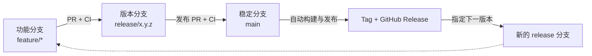
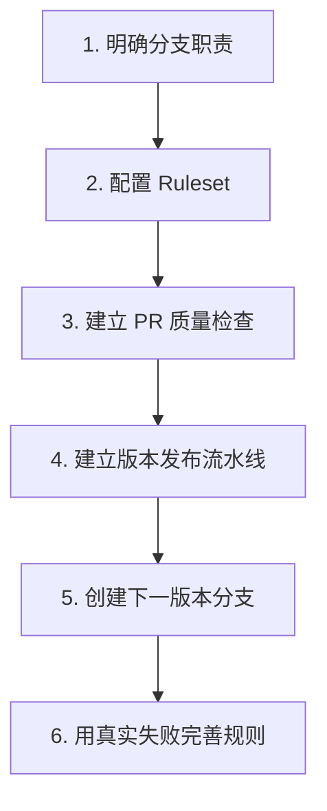
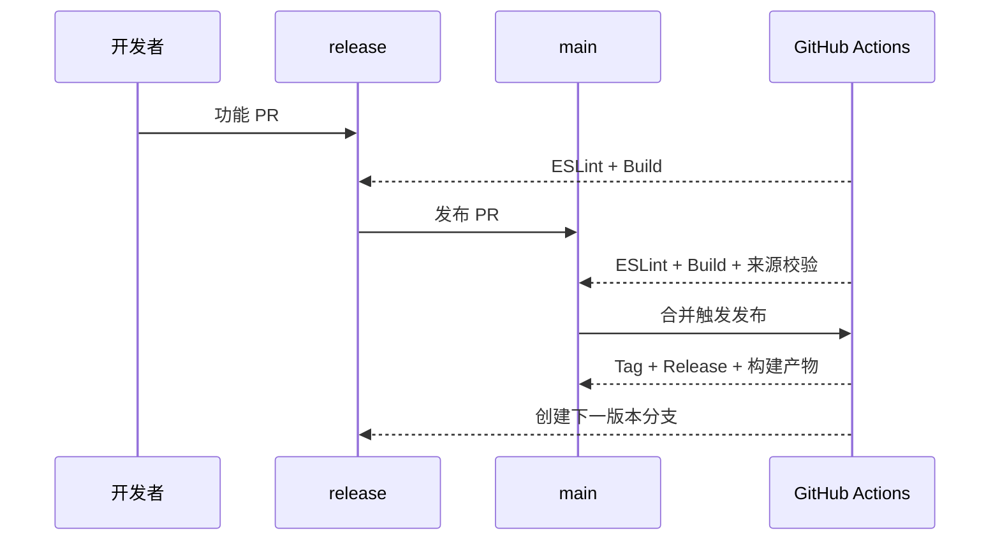
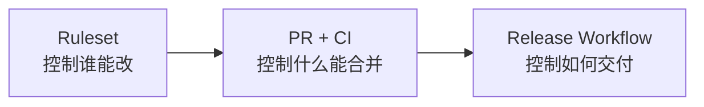

# 通过 GitHub 实现项目的 CI/CD

> 这不是一份 GitHub Actions 配置手册，而是一次从分支管理到自动发布的实践复盘。重点是：为什么这样设计、遇到了什么问题，以及面试时如何讲清楚。

## 一、项目目标

项目需要建立一条简单、可控的交付链路：

- 开发者不能直接修改 `main` 和 `release/*`。
- 功能代码先通过 PR 合入当前 release 分支。
- release 通过 PR 合入 `main` 后自动发布版本。
- 发布成功后，从最新 `main` 创建下一版本 release 分支。
- 当前不自动删除 PR 源分支，由维护者确认后再清理。

最终形成以下闭环：



## 二、学习路径

这次实践不是先写 YAML，而是按“先定规则，再做自动化”的顺序推进。



### 1. 明确分支职责

- `main`：稳定、可发布，只接受 release 分支的 PR。
- `release/x.y.z`：当前版本的集成分支，只接受功能 PR。
- `feature/*`、`codex/*`：日常开发分支，可以正常推送。

分支职责越清晰，后续 Ruleset 和 Actions 就越简单。

### 2. 使用 Ruleset 约束流程

`main` 和 `release/*` 都要求通过 PR 修改，并禁止强制推送和随意删除。

主要区别是：

- release 要求 `eslint`、`build` 通过。
- main 除了质量检查，还要求 `release-source` 通过。
- `release-source` 用来阻止功能分支绕过 release，直接进入 main。

### 3. 使用 Actions 承担自动化

项目最终拆分为四个职责单一的工作流：

- `ci`：在 PR 中运行 ESLint 和构建。
- `policy`：校验进入 main 的来源分支必须是 `release/*`。
- `publish-release`：release 合入 main 后创建 Tag、GitHub Release 和构建产物。
- `start-next-release`：输入下一版本号，从最新 main 创建新的 release 分支。

这种拆分符合单一职责原则，也方便单独定位失败环节。

## 三、日常开发流程

开发者只需要理解一条主线：从当前 release 拉出功能分支，开发完成后向 release 提 PR。

```bash
git fetch origin
git checkout release/0.2.0
git checkout -b feature/example

# 开发完成后
git add <本次修改的文件>
git commit -m "feat: 完成功能"
git rebase origin/release/0.2.0
git push -u origin feature/example
```

随后在 GitHub 页面创建 PR：

```text
feature/example → release/0.2.0
```

PR 通过 `eslint`、`build` 后才能合并。开发者不直接接触 main，也不承担版本发布操作。

## 四、版本发布流程

维护者确认当前 release 已具备发布条件后，创建：

```text
release/0.2.0 → main
```

合并前会经过三项检查：

- `eslint`
- `build`
- `release-source`

合并后，发布流水线再次构建代码，并创建：

```text
Git Tag：v0.2.0
GitHub Release：v0.2.0
构建产物：think-chain-0.2.0.zip
```

最后由维护者在 Actions 页面运行 `start-next-release`，输入下一个版本号，例如 `0.3.0`。工作流会从最新 main 创建：

```text
release/0.3.0
```

下一轮开发由此开始。



## 五、ci/cd实现过程中遇到的问题

### 问题 1：Actions 已通过，Ruleset 仍显示 Pending

Ruleset 最初配置的是：

```text
ci / eslint
ci / build
```

但 GitHub 实际上报的检查名称是 job 名：

```text
eslint
build
```

名称无法精确匹配时，Ruleset 会一直等待一个永远不会出现的检查。

**结论：** 必需检查应使用 GitHub 实际上报的 context，而不是凭界面展示形式手动拼接名称。

### 问题 2：CI 在安装依赖时失败

pnpm 11 默认会检查依赖发布时间。锁文件中的少量依赖发布未满 24 小时，导致全新 CI 环境拒绝安装，而本地因为已有依赖缓存没有暴露问题。

最终只对已经确认的精确版本增加例外，没有全局关闭供应链保护。

**结论：** CI 的干净环境能够发现本地缓存掩盖的问题；安全策略应尽量精确放行，不应整体关闭。

### 问题 3：无法创建下一版本 release 分支

release Ruleset 要求分支创建时就具备 `eslint`、`build` 检查，但新分支还不存在，自然无法提前产生检查结果。

解决方式是在 release Ruleset 中启用：

```text
Do not require status checks on creation
```

这只放行“创建分支”动作，后续向 release 合入代码时仍然必须通过 PR 和 CI。

**结论：** 分支创建也是一次受 Ruleset 管理的写操作，需要单独考虑创建阶段和更新阶段。

### 问题 4：受保护的测试 release 无法删除

`release/*` 开启删除限制后，测试分支同样受到保护。为了删除单个测试分支，可以在 Ruleset 中临时排除准确分支名，删除后立即恢复规则。

**结论：** 不要为了处理一个分支而关闭整套保护，应尽量缩小例外范围。

## 六、真正的难点

### 1. 规则之间存在先后依赖

CI 需要先运行，Ruleset 才能识别检查；新分支需要先创建，CI 才有运行对象。这类“先有鸡还是先有蛋”的关系，是配置流水线时最容易忽略的地方。

### 2. 自动化不等于全部自动决定

下一个版本可能是 patch、minor 或 major，流水线不能替维护者做业务判断。因此本项目选择手动输入下一版本号，再自动创建分支。

这是“人负责决策，机器负责执行”的边界。

### 3. 发布前后都需要验证

PR 检查保证代码可以进入 main；发布流水线再次构建，保证最终产物确实来自 main 中已合并的代码。

两次构建看似重复，实际上分别保护“代码合并”和“版本交付”。

## 七、为什么需要这么做的原因


**为什么不让功能分支直接进入 main？**

 release 是版本集成层，可以集中控制本次发布范围，避免 main 混入尚未计划发布的功能。

**为什么下一版本不是全自动递增？**

版本级别属于产品和发布决策。手动输入版本号比默认递增 patch 更可控，也更容易审计。

**如何保证发布产物可信？**

产物从 main 的合并结果重新构建，不复用开发者本地产物；工作流权限保持最小化，发布步骤才使用写权限。

**这套方案还能如何演进？**

后续可以增加测试、部署环境审批、自动生成变更日志和回滚流程，但在当前规模下没有提前引入这些复杂度。

## 八、总结

配合AI从零实现了一套可部署的ci/cd流水线，理解了ruleset功能、yam脚本配置、workflow搭建



